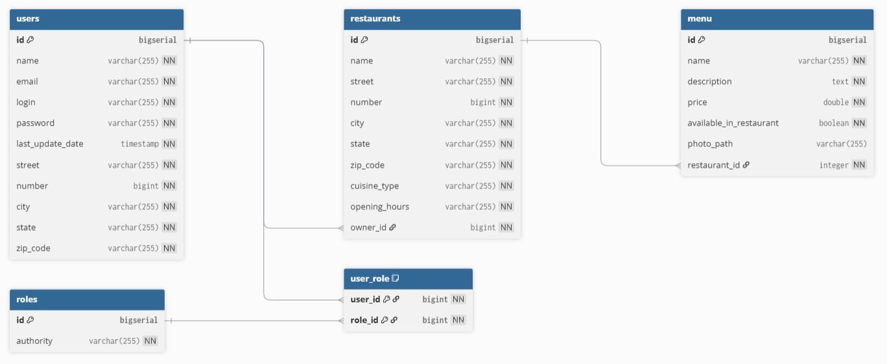
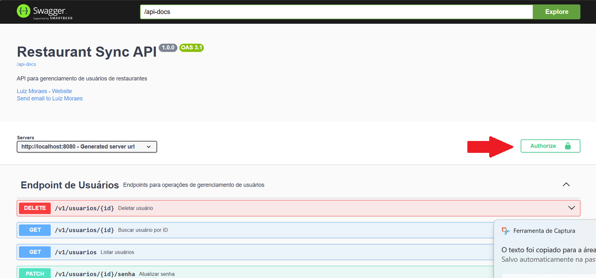
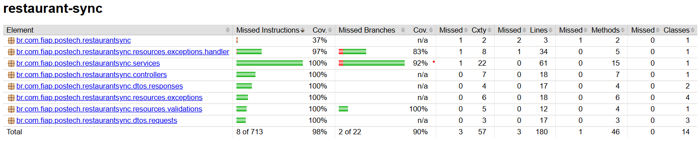

#  Tech Challenge 2ª Fase - **restaurant-sync**

## ÍNDICE

* [Descrição do Projeto](#descrição-do-projeto)
* [Funcionalidades e Endpoints](#funcionalidades-e-endpoints)
   * [👨‍💻 Gerenciamento de Usuários](#-gerenciamento-de-usuários)
   * [🏨 Gerenciamento de Restaurantes](#-gerenciamento-de-restaurantes)
   * [🍽️ Gerenciamento de Cardápios](#-gerenciamento-de-cardápios)
* [Tecnologias Utilizadas](#tecnologias-utilizadas)
* [Estrutura do Projeto](#estrutura-do-projeto)
* [Diagrama das tabelas de banco de dados](#diagrama-das-tabelas-de-banco-de-dados)
* [Requisitos](#requisitos)
* [Como Rodar o Projeto](#como-rodar-o-projeto)
* [Endpoints](#endpoints)
* [Documentação da API](#documentação-da-api)
* [Cobertura de código](#cobertura-de-código)
* [Collection POSTMAN](#collection-postman)
* [Environment POSTMAN](#environment-postman)

## Descrição do Projeto

API para gerenciamento de usuários de restaurantes, desenvolvida como parte da **Fase 2** do **Tech Challenge FIAP**. Esta fase foca na implementação das funcionalidades essenciais para o gerenciamento de usuários, permitindo o cadastro, atualização, exclusão e validação de login de dois tipos de usuários: **donos de restaurante** e **clientes**.

O sistema é construído com **Spring Boot**, **Docker**, e **Docker Compose**, sendo integrado a um banco de dados relacional **PostgreSQL** e **H2** para testes.

## Funcionalidades e Endpoints

### 👨‍💻 Gerenciamento de Usuários
| Operação                         | Descrição                               | Acesso        |
|----------------------------------|-----------------------------------------|---------------|
| `POST   /v1/users`               | Cria novo registro de usuário           | Público       |
| `GET    /v1/users`               | Lista todos os usuários (paginado)      | Admin         |
| `GET    /v1/users/{id}`          | Obtém detalhes de um usuário específico | Admin         |
| `DELETE /v1/users/{id}`          | Remove usuário do sistema               | Admin         |
| `PUT    /v1/users/{id}`          | Atualiza informações do usuário         | Admin/Cliente |
| `PATCH  /v1/users/{id}/password` | Altera senha do usuário                 | Admin         |
| `POST   /v1/oauth2/token`        | Gera token de autenticação              | Público       |

### 🏨 Gerenciamento de Restaurantes
| Operação                        | Descrição                                   | Tipo    |
|---------------------------------|---------------------------------------------|---------|
| `POST   /v1/restaurants`        | Cadastra novo restaurante                   | Admin   |
| `GET    /v1/restaurants`        | Lista todos os restaurantes (paginado)      | Admin   |
| `GET    /v1/restaurants/{id}`   | Obtém detalhes de um restaurante específico | Admin   |
| `PUT    /v1/restaurants/{id}`   | Atualiza informações do restaurante         | Admin   |
| `DELETE /v1/restaurants/{id}`   | Remove restaurante do sistema               | Admin   |

### 🍽️ Gerenciamento de Cardápios
| Operação                             | Descrição                                | Tipo   |
|--------------------------------------|------------------------------------------|--------|
| `POST   /v1/menus`                   | Adiciona novo item ao cardápio           | Admin  |
| `GET    /v1/menus`                   | Lista todos os itens do menu (paginado)  | Admin  |
| `GET    /v1/menus/{id}`              | Obtém detalhes de um item específico     | Admin  |
| `PUT    /v1/menus/{id}`              | Atualiza todas informações do item  b    | Admin  |
| `DELETE /v1/menus/{id}`              | Remove item do cardápio                  | Admin  |
| `PATCH  /v1/menus/{id}/availability` | Altera status de disponibilidade do item | Admin  |

> ⚠️ **Importante:**  
> Antes de utilizar a API para as demais funcionalidades, o usuário **precisa estar cadastrado** (`POST /v1/usuarios`) e **autenticado** (`POST /oauth2/token`) para obter o **token de acesso**.  
> Esse token deve ser incluído no cabeçalho `Authorization` das requisições aos endpoints protegidos:  
> `Authorization: Bearer <token>`
>
> Além disso, **algumas operações são restritas a administradores**, como listar ou excluir usuários.


## Tecnologias Utilizadas


## Estrutura do Projeto

A aplicação segue uma arquitetura em camadas bem definida, visando modularidade e manutenibilidade. Abaixo está a estrutura principal de pastas:

```
├── collection                  # Collections do Postman para teste dos endpoints da API
│
├── src                         
│   ├── main                    
│   │   ├── java                
│   │   │   └── br              
│   │   │       └── com
│   │   │           └── fiap
│   │   │               └── postech
│   │   │                   └── restaurantsync
│   │   │                       │
│   │   │                       ├── application      # Camada de aplicação (interface)
│   │   │                       │   ├── controllers  # Controladores REST (adaptadores primários)
│   │   │                       │   ├── dtos         # Objetos de Transferência de Dados
│   │   │                       │   │   ├── requests # Modelos de entrada da API
│   │   │                       │   │   └── responses # Modelos de saída da API
│   │   │                       │   └── gateways     # Interfaces para serviços externos
│   │   │                       │
│   │   │                       ├── domain           # Núcleo do domínio (regras de negócio)
│   │   │                       │   ├── entities      # Entidades de domínio ricas
│   │   │                       │   ├── gateways      # Interfaces de repositórios
│   │   │                       │   └── usecases     # Casos de uso do sistema
│   │   │                       │       ├── menu      # Operações específicas de cardápio
│   │   │                       │       ├── restaurant # Operações de restaurantes
│   │   │                       │       └── user      # Operações de usuários
│   │   │                       │
│   │   │                       └── infrastructure   # Implementações técnicas
│   │   │                           ├── config       # Configurações do sistema
│   │   │                           │   ├── dependency # Injeção de dependências
│   │   │                           │   ├── doc      # Configuração de documentação
│   │   │                           │   └── security # Segurança e autenticação
│   │   │                           │       └── custom # Implementações customizadas
│   │   │                           │
│   │   │                           ├── exceptions   # Tratamento de erros
│   │   │                           │   └── handler  # Manipuladores de exceções
│   │   │                           │
│   │   │                           ├── persistence  # Implementação de persistência
│   │   │                           │   ├── entity   # Entidades JPA (ORM)
│   │   │                           │   └── repository # Repositórios Spring Data
│   │   │                           │
│   │   │                           └── validations  # Validações customizadas
│   │   │
│   │   └── resources            # Recursos não-Java
│   │       ├── db               # Migrações de banco de dados
│   │       │   └── migration    # Scripts Flyway (SQL)
│   │       ├── static           # Arquivos estáticos
│   │       └── templates        # Templates de views
│   │
│   └── test                    # Código de testes
│       ├── java                # Testes unitários/integração
│       │   └── br              # Estrutura espelhada do main
│       │       └── com
│       │           └── fiap
│       │               └── postech
│       │                   └── restaurantsync
│       │                       │
│       │                       ├── application      # Testes de controllers
│       │                       │   ├── controllers  # Testes de endpoints
│       │                       │   └── gateways     # Testes de adaptadores
│       │                       │
│       │                       ├── domain           # Testes de domínio
│       │                       │   └── usecases     # Testes de casos de uso
│       │                       │       ├── menu     # Testes específicos
│       │                       │       ├── restaurant
│       │                       │       └── user
│       │                       │
│       │                       ├── factories        # Fábricas de teste
│       │                       │
│       │                       └── infrastructure   # Testes de infra
│       │                           └── exceptions   # Testes de handlers
│       │                                └── handler
│       │
│       └── resources           # Configurações de teste
│
└── target                      # Artefatos gerados pelo build (classes, jar, relatórios, etc.)
```

## Diagrama das tabelas de banco de dados



## Requisitos

Para rodar via Docker, certifique-se de ter instalado e configurado: 

- [Git](https://git-scm.com/): necessário para clonar o repositório do projeto.
- [Java 21](https://www.oracle.com/java/technologies/javase/jdk21-archive-downloads.html): necessário para compilar e executar o projeto.
- [Maven](https://maven.apache.org/): utilizado para compilar o projeto e gerar o arquivo `.jar` que será empacotado e executado no container.
- [Docker Desktop](https://www.docker.com/): necessário para criar e executar os containers da aplicação e do banco de dados.
- [Postman](https://www.postman.com/): recomendado para testar os endpoints da API de forma interativa.

Para executar o projeto manualmente na sua máquina (sem Docker), você precisará de:

- Java 21 ou superior instalado.
- Maven instalado para compilar e construir o projeto.
- Altere o arquivo `application.properties` para utilizar o banco H2.

## Como Rodar o Projeto

Antes de iniciar, **certifique-se que todos os requisitos descritos na seção anterior estão atendidos** (Java, Maven e Docker instalados e configurados).

1. **Clone o repositório:**
   ```bash 
   git clone https://github.com/luizffdemoraes/restaurant-sync-api-tech-challenge
   ```

2. **Realize o build do projeto:**
   ```bash
   docker compose build --no-cache
   ```
   
3. **Inicie os containers:**
   ```bash
   docker compose up
   ```

4.  A API estará disponível em `http://localhost:8080`.

## Documentação da API

A documentação completa da API está disponível através do Swagger UI em:

[http://localhost:8080/swagger-ui/index.html](http://localhost:8080/swagger-ui/index.html)

> ⚠️ **Importante:**
> Para acessar a documentação interativa da API via Swagger UI e testar os endpoints, você precisará das seguintes credenciais de acesso:
>
> **Username:** myclientid<br>
> **Password:** myclientsecret
>
> 

## Cobertura de código

A cobertura de código do projeto é gerada utilizando o JaCoCo (Java Code Coverage). O processo é automatizado através do Maven.

Gerando a cobertura de código
Execute os seguintes comandos no terminal, a partir da raiz do projeto:

Executar os testes e coletar os dados de cobertura:

```bash
mvn clean test
```

- Este comando executa todos os testes automatizados do projeto.
- Durante a execução, o JaCoCo coleta os dados necessários para análise de cobertura.

Gerar os relatórios de cobertura:

```bash
mvn jacoco:report
```

- Este comando processa os dados coletados e gera os relatórios nos formatos HTML/XML/CSV.

### Acessando o relatório
O relatório gerado pode ser visualizado abrindo o arquivo:

```
target/site/jacoco/index.html
```


### Exemplo da cobertura gerada:



## Collection POSTMAN

https://github.com/luizffdemoraes/restaurant-sync-api-tech-challenge/blob/main/collection/restaurant-sync-fiap.postman_collection.json

## Environment POSTMAN

https://github.com/luizffdemoraes/restaurant-sync-api-tech-challenge/blob/main/collection/restaurant-sync-fiap.postman_environment.json
